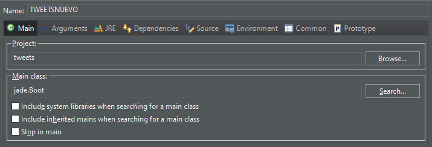
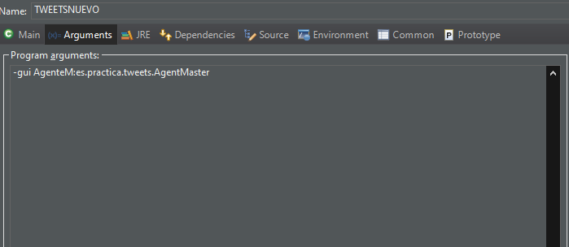
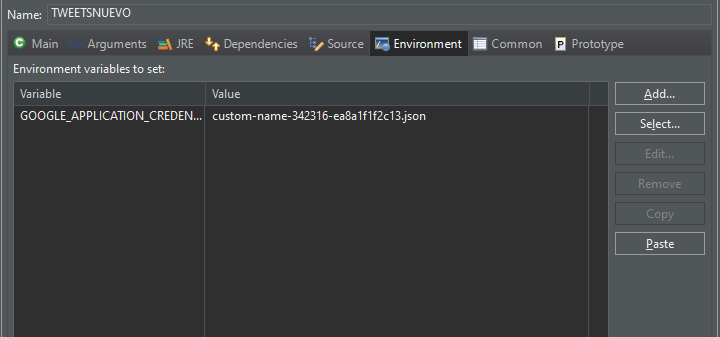

# proyectoEmocional
Proyecto para la asignatura de Sistemas Inteligentes, que trata de un sistema que hace analisis emocionales de tweets respecto a un tema determinado, pudiendo interactuar con él a través de una GUI y un bot de telegram.
Antes que nada, en local importa al classpath/buildpath las librerias de /lib
Para desplegar el proyecto en local, tienes que realizar las siguientes configuraciones:

Si quieres que las respuestas lleguen a tu instancia de chat del bot de telegram, cambia el Id de Telbot por el chatid propio tuyo (se puede obtener dando start a @RawDatabot).
